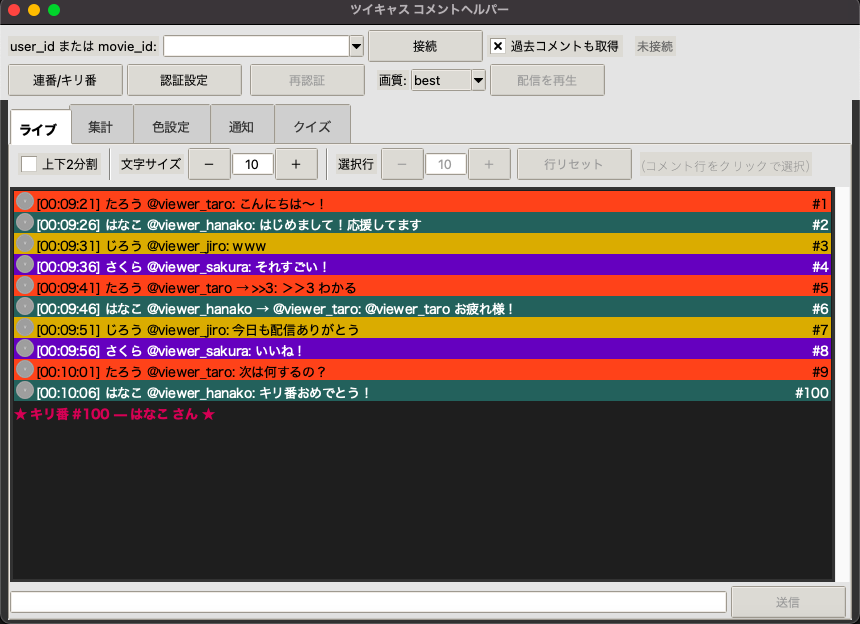
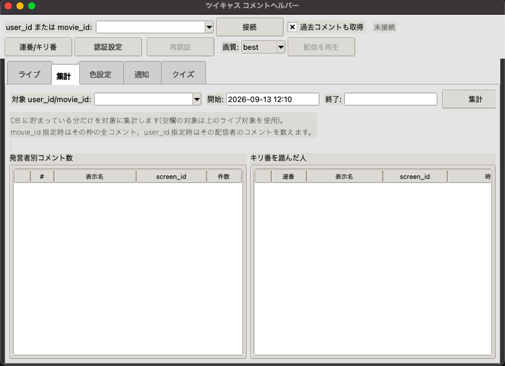
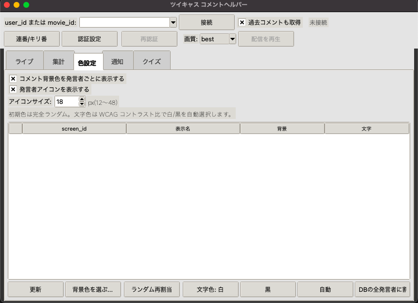
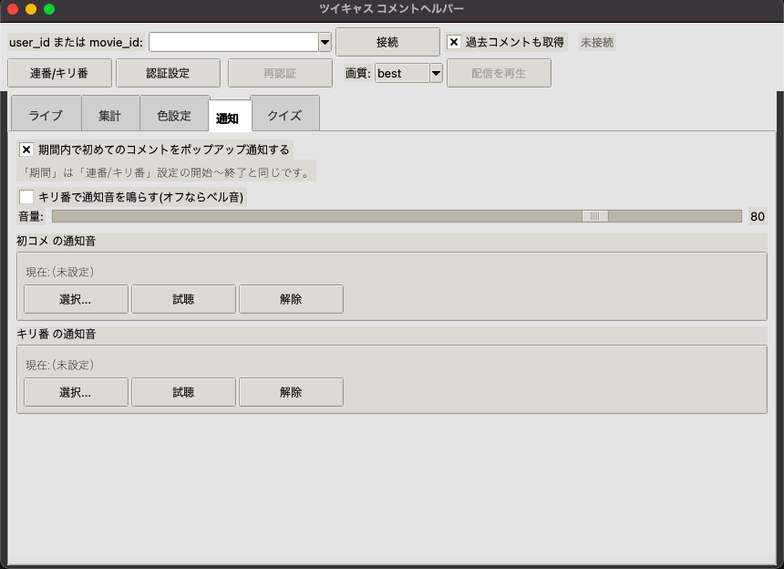
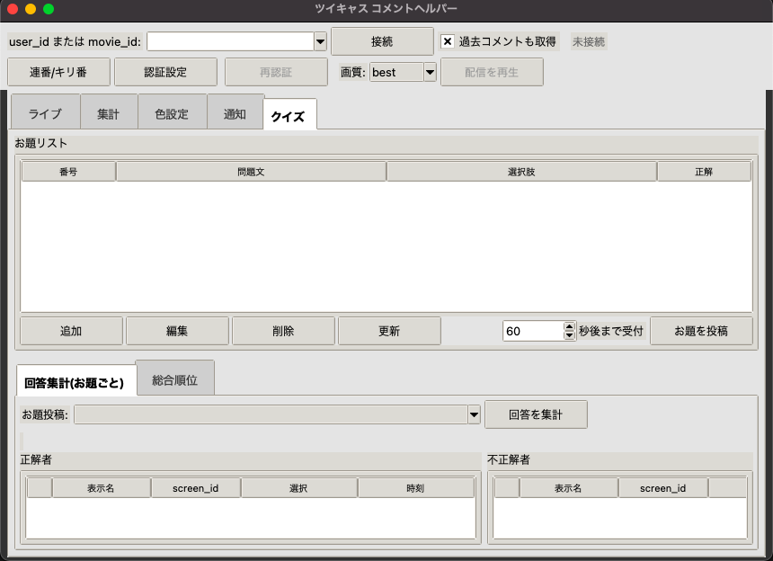

# ツイキャス コメントヘルパー 使い方ガイド(macOS版)

> 画面例のコメント・ユーザー名はすべて**説明用のサンプル**です。実際の配信者・視聴者の
> コメントではありません。

## もくじ

1. [これは何をするツールですか?](#1-これは何をするツールですか)
2. [使い始める前の準備(最初の1回だけ)](#2-使い始める前の準備最初の1回だけ)
3. [起動する](#3-起動する)
4. [最初に行う「連携の許可」](#4-最初に行う連携の許可)
5. [画面の見方](#5-画面の見方)
6. [配信につないでコメントを見る・送る](#6-配信につないでコメントを見る送る)
7. [便利な機能](#7-便利な機能)
8. [配信の映像・音声を再生する(任意の機能)](#8-配信の映像音声を再生する任意の機能)
9. [終了のしかた](#9-終了のしかた)
10. [困ったときは](#10-困ったときは)
11. [知っておいてほしいこと](#11-知っておいてほしいこと)

---

## 1. これは何をするツールですか?

パソコンの画面でツイキャスのコメントを見たり送ったりできる、無料の補助ツールです。
インストール作業は不要で、ファイルをダブルクリックするだけで使えます。

主にできること:

- 配信中のコメントを、画面に流れる形でリアルタイムに近く表示する
- コメントを配信に投稿する
- 過去のコメントをさかのぼって記録する
- 発言者ごとにコメントの色を変えて見やすくする
- 発言者の名前の横にアイコン(顔写真)を表示する
- コメント表示を上下2つに分けて別々にスクロールする / 文字の大きさを全体・行ごとに変える
- 「100人目」のような区切りの良いコメント順番(キリ番)を音とお知らせで教えてくれる
- はじめて発言した人をポップアップでお知らせする
- クイズを出して、コメントでの回答を自動で集計する
- (任意)配信の映像・音声を同じ画面のそばで再生する

---

## 2. 使い始める前の準備(最初の1回だけ)

このツールを使うには、ツイキャスに「このツールを使いますよ」という登録を一度だけ行い、
専用の合言葉(Client ID / Client Secret)を発行してもらう必要があります。難しい操作はありません。

1. ブラウザで [ツイキャス開発者向けページ](https://twitcasting.tv/developer.php) を開きます。
2. 「アプリケーションを作成」を選びます。
3. 次のとおり入力します。
   - **アプリ名**: 好きな名前でかまいません(例: `わたしのコメントヘルパー`)
   - **概要 / 説明**: 好きな説明でかまいません
   - **アクセス権限**: 「読み取り」と「書き込み」の**両方**にチェックを入れる
   - **Callback URL**: 下の枠の内容を、そのまま**コピーして貼り付け**てください
     ```
     http://127.0.0.1:8000/callback
     ```
4. 作成すると、「Client ID」と「Client Secret」という2つの文字列が発行されます。
   この2つは後で使うので、メモ帳などに控えておいてください。

> **補足**: この合言葉は最初に一度入力するだけで大丈夫です。一度うまくいけば、
> 次回からツールを起動するだけで自動的につながります。

---

## 3. 起動する

`TwitCastingCommentHelper.app` をダブルクリックします。

初回だけ「開発元が未確認のため開けません」と出ることがあります。その場合は次のいずれかで開けます。

- アイコンを**右クリック(またはControlキーを押しながらクリック)→「開く」**を選ぶ
- それでも開けない場合は、[困ったときは](#10-困ったときは)の「アプリが起動しない」を参照してください

---

## 4. 最初に行う「連携の許可」

ツールを初めて起動すると、あなたのツイキャスアカウントとの連携を許可する画面に進みます。

1. 「Client IDを入力してください」「Client Secretを入力してください」という入力欄が
   順番に出るので、[準備](#2-使い始める前の準備最初の1回だけ)で控えた値をそれぞれ貼り付けます。
2. 自動的にブラウザが開きます。
   (開かない場合は、ツールの画面に表示されているアドレスをブラウザに貼り付けて開いてください)
3. ツイキャスにログインし、「(アプリ名)があなたのアカウントへのアクセスを求めています」という
   画面が出たら「許可する」を選びます。
4. ブラウザに「認可が完了しました」と表示されたら、そのタブは閉じてかまいません。
5. ツールの画面が「未接続」と表示されれば準備完了です。

- この作業は最初の1回だけで大丈夫です。次回からは自動でつながります。
- 「許可する」を選ぶまでの制限時間は10分です。時間が過ぎてしまったら、もう一度ツールを
  起動しなおしてやり直してください。

---

## 5. 画面の見方

起動直後(未接続)の画面はこのようになっています。上から「上のバー(接続欄)」→
「タブ」→「コメント欄」→「送信欄」という並びです。



下は実際にコメントを受信しているときの例です。発言者ごとに行全体が色分けされ、
右端には通し番号(連番)が表示されています。「100」のようなキリ番に達すると、
専用の行(★キリ番...★)でお知らせされます。

- **上のバー**: 見たい配信を指定して「接続」するための欄です。
  一度接続したことのある配信は▼から選べます。次に起動したときも、前回つないだ配信が
  自動で入っています。
- **タブ**: 画面上部に並ぶ「ライブ」「集計」「色設定」などのボタンで、表示する画面を切り替えます。
- **コメント欄の上のツールバー**:「上下2分割」「文字サイズ」「選択行」があります(→ §7「コメントの表示を調整する」)。
- **コメント欄**: 接続中の配信のコメントが流れます。
- **送信欄**: 一番下の入力欄に文字を入れて「送信」を押すと、配信にコメントを投稿できます。

---

## 6. 配信につないでコメントを見る・送る

### コメントを見る

1. 上のバーの入力欄に、見たい配信者のIDを入力します(例: `twitcasting_jp`)。
2. 「接続」を押します。
3. コメントが表示され始めます(数秒おきに更新されます)。配信が終わると自動的に切断されます。

### コメントを送る

配信につながっている状態で、画面下の入力欄にコメントを入力し、「送信」を押すか
Enterキーを押します(140文字まで)。

---

## 7. 便利な機能

### 過去のコメントも記録する

上のバーの「過去コメントも取得」にチェックが入っていると、接続したときにその配信の
過去コメントもさかのぼって記録します(はじめから付いています)。取得中は画面下部に
進み具合が表示されます。通信が不安定でも自動でやり直すので、そのままお待ちください。

集計タブでは、DBに貯まっている分だけを対象に、発言者ごとのコメント数やキリ番を
踏んだ人を一覧で確認できます。



### コメントの順番(連番)とキリ番のお知らせ

各コメントの通し番号(`#123`)は、その配信での通し番号として、コメント行の**右端に
寄せて**表示されます。上のバーの「連番/キリ番」ボタンから、「100人目」のようにお知らせしたい
番号を自由に設定できます。該当する番号のコメントが来ると、目立つ色で強調表示されます。
お知らせの音(既定はベル音)は「通知」タブで好きな音声ファイルに変更できます
(→ [はじめてのコメントをお知らせ](#はじめてのコメントをお知らせ))。

### 発言者ごとの色分け・アイコン表示

「色設定」タブで、コメントを発言者ごとの色で表示するかどうかを切り替えられます。色を付けると
その行全体(右端の余白まで)が背景色で塗られます。発言者の名前の横にアイコン(顔写真)を
表示することもできます。アイコンのサイズも変更でき、
大きくするとコメント行の高さもそれに合わせて広がります。表示に失敗したアイコンは、
しばらくすると自動で取り直します。



**アイコンをクリックすると拡大表示**します(まず等倍)。ウィンドウの枠をドラッグすれば
自由に大きく/小さくできます。少し待つと裏でより高画質な画像に自動で差し替わります
(その間もウィンドウの大きさは変わりません)。閉じるにはタイトル部分をクリックするか
Esc、ウィンドウの✕ボタンを使います。

ログインしていれば、画像の下にその人の**プロフィール文・レベル・サポーター数・配信中かどうか**
も表示されます(公開されている範囲のみ)。「配信ページを開く」ボタンでブラウザからその人の
ツイキャスページを開けます。

### コメントの表示を調整する

「ライブ」タブのコメント欄のすぐ上にツールバーがあります。

- **上下2分割**: チェックを入れると、コメント欄が上下2つに分かれます。上は好きな位置に
  止めて過去のコメントを読み、下は新しいコメントを自動で追いかけます(中央の境目を
  ドラッグして高さを変えられます)。チェックを外すと元の1つに戻ります。起動するたびに
  「分割なし」に戻ります。
- **文字サイズ**: `[－] [数字] [＋]` でコメント全体の文字の大きさ(6〜48)を変えます。
  数字の欄に直接入れて Enter でも変わります。この設定は次に起動しても保たれます。
- **選択行**: コメントを1行クリックすると黄色くなり、その行だけ文字サイズを変えられます。
  「行リセット」で元に戻ります。行ごとの変更は保存されず、その場限りです
  (画面から流れて消えると解除されます)。

### はじめてのコメントをお知らせ

「通知」タブでは、次の2つを設定できます。



- **初コメ通知**: その期間に初めてコメントした人が来たら、画面右下にポップアップ(名前+本文)
  でお知らせします。こちらは音の設定に関わらず常に使えます。
- **キリ番の通知音**: チェックを入れると、キリ番のコメントが来たときの音を既定のベル音から
  好きな音声ファイル(wav/mp3/flac/ogg)に変更できます。「選択...」でファイルを選び、
  「試聴」でその場で確認、「解除」で既定のベル音に戻せます。初コメ通知にも同じ仕組みで
  専用の音声ファイルを設定できます。音量はスライダーで調整します。

> 通知音を鳴らすには **miniaudio** というモジュールが必要です。配布されている `.app`
> には最初から含まれているのでそのまま使えます(スクリプト版で `pip install` していない
> 場合だけ、通知音の欄がグレーアウトします。ポップアップ通知はその場合でも問題なく動きます)。

### クイズを出して集計する

「クイズ」タブから、選択肢つきのクイズを配信にコメントとして投稿できます。
投稿してから何秒間の回答を集計するかも自由に設定できます。回答の集計結果は
「正解した人」「不正解だった人」に分けて表示され、複数回クイズを行った合計の
ランキングも見られます。



---

## 8. 配信の映像・音声を再生する(任意の機能)

コメントを見るだけでなく、配信の映像と音声も同じツールのそばで再生できます。
**使わなくても他の機能(コメントの閲覧・送信など)には一切影響しません**ので、
興味が無ければこの章は読み飛ばしてかまいません。

### 8.1 必要なもの

再生の裏側では、映像データを取り出す部分(streamlink)と、それを画面に映す部分
(プレイヤー)の2つが動いています。

- **映像データを取り出す部分**: このツールに**最初から含まれています**。準備は不要です。
- **画面に映すプレイヤー**: **VLC メディアプレイヤー**(無料)を別途インストールしてください。
  これ1つだけ入れれば再生できます。

### 8.2 VLC を入れる

1. ブラウザで [VLC公式サイト](https://www.videolan.org/vlc/download-macosx.html) を開きます。
2. 「Download VLC」を選んでダウンロードします。
3. ダウンロードした `.dmg` ファイルをダブルクリックして開きます。
4. 開いたウィンドウの中の「VLC」アイコンを、「Applications(アプリケーション)」フォルダへ
   ドラッグ&ドロップします。

> VLC は最も広く使われている無料の動画プレイヤーです。ターミナル操作は不要で、
> 普通のアプリと同じようにインストールできます。

### 8.3 使ってみる

1. 見たい配信者のIDで**接続**します(数字だけのライブIDでは、配信者が特定できず
   再生できないことがあります。screen_idでの接続がおすすめです)。
2. 上のバーにある画質のプルダウンから、見たい画質を選びます(`best` がいちばん高画質です)。
3. **「配信を再生」**ボタンを押します。
4. 少し待つと、VLC の別ウィンドウが開いて映像・音声の再生が始まります。
5. やめたいときは、同じ場所のボタン(**「再生を停止」**に変わっています)を押します。
   コメントの受信を切断しても再生は止まりません。ツール自体を終了すると再生も止まります。

### 8.4 うまくいかないとき

**Q. 「再生プレイヤーが見つかりません」と出る**
A. VLC がインストールされていないか、標準以外の場所に入っています。
   [8.2](#82-vlc-を入れる)の手順でVLCを入れ直し、ツールを起動し直してください。

**Q. 「streamlinkが見つかりません」と出る**
A. 通常は出ません(ツールに同梱済みのため)。出る場合はツールのファイルが
   一部壊れている可能性があるので、配布物を受け取り直してください。

**Q. 再生がしばらくすると止まる、または始まらない**
A. ツイキャス側の仕様変更が原因のことがあります。時間をおいて再度お試しください。
   ツールのアップデートで直る場合があります。

**Q. 再生を止めたのに、VLCのウィンドウが画面に残っている**
A. そのまま手動でウィンドウを閉じてかまいません。ツールの他の機能には影響しません。

---

## 9. 終了のしかた

ウィンドウ左上の赤い「×」ボタンで閉じてください。作業中の内容は安全に保存されます。

---

## 10. 困ったときは

**Q. アプリが起動しない(権限がないと言われる/開けない)**
A. 次の手順を順番に試してください。

1. アイコンを右クリックして「開く」を選ぶ
2. それでも開けない場合は、「ターミナル」アプリを開いて次のように入力し、Enterキーを押します
   (`/path/to/` の部分は、実際にアプリを置いた場所に合わせてください。アプリのアイコンを
   ターミナルの画面にドラッグ&ドロップすると、パスが自動で入力されて簡単です)。
   ```
   xattr -dr com.apple.quarantine "/path/to/TwitCastingCommentHelper.app"
   ```
3. それでも開けない場合は、次のコマンドも試してください。
   ```
   chmod 755 "/path/to/TwitCastingCommentHelper.app"
   ```

**Q. 「連携の許可」の画面からブラウザで許可したのに、うまく接続できない**
A. しばらく待っても「未接続」のまま変わらない場合は、パソコンを再起動してからもう一度
   試してください。他のアプリが同じ通信の窓口を使っていて、うまくいかないことがあります。

**Q. 「認可がタイムアウトしました」と出る**
A. 許可の操作に10分以上かかった場合に出ます。ツールをもう一度起動して、最初からやり直してください。

**Q. 指定した配信者につながらない・「現在配信していません」と出る**
A. IDが間違っているか、今は配信していない可能性があります。IDを確認してもう一度お試しください。

**Q. アイコンが表示されない**
A. アイコンは表示されるまで数秒かかることがあります。「色設定」タブで
   「発言者アイコンを表示する」にチェックが入っているかも確認してください。
   プロフィール画像を設定していない人は、色つきの丸のまま表示されます。

**Q. 突然「接続失敗」と表示されて使えなくなった**
A. 連携の許可が期限切れになった可能性があります。表示されるダイアログで「はい」を選ぶか、
   上のバーの「再認証」ボタンを押し、ブラウザでもう一度許可してください
   (ツールを閉じ直す必要はありません)。

**Q. 記録したコメントの履歴や色分けを全部消したい**
A. ツールを終了し、[知っておいてほしいこと](#11-知っておいてほしいこと)に記載の保存場所にある
   `comments.sqlite3` という名前のファイルを削除してください。連携の許可には影響しません。

---

## 11. 知っておいてほしいこと

- アイテム(ギフト)の表示は、**自分自身の配信**に贈られたものだけが対象です。他の人の
  配信を見ているときは表示されません。
- コメントの更新は数秒おきのため、実際の配信より少し遅れて表示されます。
- ごくまれに同じコメントが2回表示されることがありますが、実害はありません。
- 古い配信ほど、過去コメントを全部はさかのぼれないことがあります(ツイキャス側の制限です)。
- 一度に接続できる配信は1つだけです。
- 配信の映像・音声の再生([8章](#8-配信の映像音声を再生する任意の機能))は、ツイキャス側から
  映像データを取り出す仕組み(ツールに同梱)を使っているため、ツイキャス側の仕様変更で
  一時的に再生できなくなることがあります。再生には別途 VLC のインストールが必要です。
- このツールが保存するデータ(コメントの記録、連携の許可情報など)は、すべてお使いの
  パソコンの中だけに保存されます。外部に送信されることはありません。
- 保存場所: `~/Library/Application Support/twitcasting_helper/`(Finderの「移動」→
  「フォルダへ移動...」に貼り付けると開けます)。
